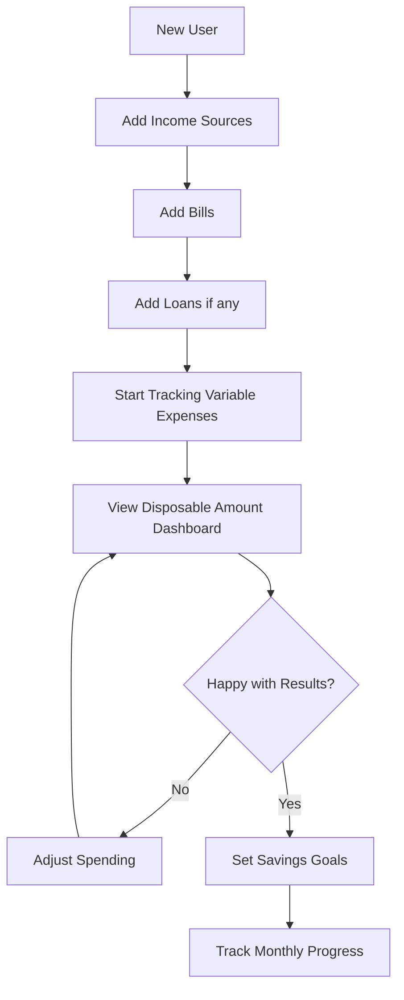
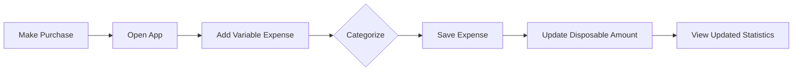
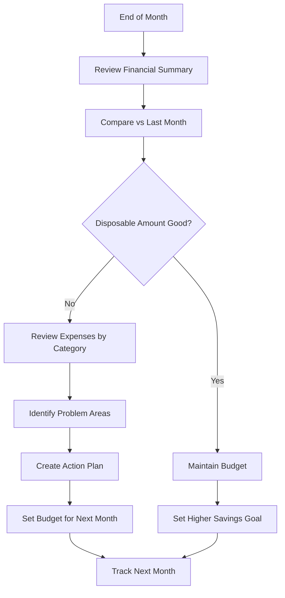

# 💰 Disposable Amount & Financial Dashboard — Complete Flow

## 📌 Document Overview

This document describes the complete system for tracking income, expenses (fixed and variable), and calculating disposable amount — the money remaining after all obligations are met. This feature enables users to understand their financial health, track spending patterns, and make informed financial decisions.

**📍 IMPORTANT: This feature is FULLY IMPLEMENTED and PRODUCTION READY!**

---

## 🚀 Implementation Status

**Version:** 1.0.0  
**Status:** ✅ **LIVE & PRODUCTION READY**  
**Release Date:** October 11, 2025  
**Latest Update:** Initial Release

### Quick Links
- 🔌 [API Documentation](./disposableAmountApiDocumentation.md) - Complete API reference
- 💻 [Quick Start Guide](./DASHBOARD_QUICK_START.md) - Frontend integration examples
- 📊 [Dashboard Widgets Guide](./dashboardWidgetsGuide.md) - UI components reference
- 🔧 [Implementation Details](../DISPOSABLE_AMOUNT_FEATURE_IMPLEMENTATION.md) - Technical details

### All Features Implemented ✅

| Feature | Status | Endpoint |
|---------|--------|----------|
| Current Month Disposable Amount | ✅ Live | `GET /api/Dashboard/disposable-amount/current` |
| Monthly Disposable Amount | ✅ Live | `GET /api/Dashboard/disposable-amount/monthly` |
| Custom Date Range | ✅ Live | `GET /api/Dashboard/disposable-amount/custom` |
| Financial Summary Dashboard | ✅ Live | `GET /api/Dashboard/financial-summary` |
| Variable Expense CRUD | ✅ Live | `GET/POST/PUT/DELETE /api/VariableExpenses` |
| Expense Statistics | ✅ Live | `GET /api/VariableExpenses/statistics/by-category` |
| Income Sources Integration | ✅ Live | Uses existing `/api/IncomeSource` |
| Bills Integration | ✅ Live | Uses existing `/api/Bills` |
| Loans Integration | ✅ Live | Uses existing `/api/Loans` |
| Automated Insights | ✅ Live | Included in all responses |
| Period Comparison | ✅ Live | Previous period vs current |
| Savings Goal Tracking | ✅ Live | Optional parameters |
| Admin User Access | ✅ Live | `GET /api/Dashboard/.../user/{userId}` |

### Test It Now! 🧪
```
1. Open: http://localhost:5000/swagger
2. Click "Authorize" and enter your JWT token
3. Navigate to "Dashboard" or "VariableExpenses" sections
4. Try any endpoint from the table above
5. All endpoints are documented and working!
```

---

## 💡 1. Definition

**Your Disposable Amount** is the money left after paying all your fixed and variable expenses.

It's what you can spend freely, save, or allocate to goals.

**Why It Matters:**
- ✅ Know exactly how much you can save or spend
- ✅ Track if you're living within your means
- ✅ Plan for emergencies and future goals
- ✅ Identify areas to cut costs
- ✅ Build financial security

---

## ⚙️ 2. Formula

### Basic Formula

```
Disposable Amount = Total Income - (Total Fixed Expenses + Total Variable Expenses)
```

**Where:**
- **Total Income** = All earnings (salary, bonuses, freelance, etc.)
- **Total Fixed Expenses** = Rent, loans, insurance, subscriptions, etc.
- **Total Variable Expenses** = Utilities, groceries, fuel, entertainment, etc.

**For the Simple API (`/api/Dashboard/summary`):**
```
Remaining Amount = Total Income - Total Expenses - Total Savings

Where:
├── Total Income       = Sum of all active income sources (monthly)
├── Total Expenses     = Bills + Loans
├── Total Savings      = Savings deposits this month
└── Remaining Amount   = What's left for discretionary use
```

---

## 🧮 3. Step-by-Step Computation Example

### Step 1 — List Your Monthly Income

| Source | Amount ($) |
|--------|-----------|
| Salary | 45,000 |
| Freelance | 5,000 |
| **Total Income** | **50,000** |

```
Total Income = 45,000 + 5,000 = $50,000
```

---

### Step 2 — List Your Fixed Expenses

| Fixed Expense | Amount ($) |
|---------------|-----------|
| Rent | 12,000 |
| Loan Payment | 4,000 |
| Internet | 1,500 |
| Insurance | 2,000 |
| **Total Fixed Expenses** | **19,500** |

```
Total Fixed = $19,500
```

---

### Step 3 — List Your Variable Expenses

**(Use weekly → monthly conversion for accuracy)**

| Variable Expense | Weekly Avg ($) | Monthly Estimate (×4.33) | Monthly Total ($) |
|------------------|---------------|-------------------------|------------------|
| Groceries | 1,800 | 1,800 × 4.33 | 7,794 |
| Transportation | 700 | 700 × 4.33 | 3,031 |
| Dining | 500 | 500 × 4.33 | 2,165 |
| **Total Variable** | | | **12,990** |

```
Total Variable = 12,990
```

**Weekly to Monthly Conversion:**
```
Weekly Amount × 4.33 = Monthly Amount
(52 weeks ÷ 12 months = 4.33)
```

---

### Step 4 — Compute Disposable Amount

```
Disposable Amount = 50,000 - (19,500 + 12,990)
Disposable Amount = 50,000 - 32,490 = $17,510
```

```
╔═══════════════════════════════════════╗
║  CALCULATION BREAKDOWN                ║
╠═══════════════════════════════════════╣
║  Total Income:            $50,000    ║
║                                       ║
║  Fixed Expenses:         -$19,500    ║
║  Variable Expenses:      -$12,990    ║
║  ─────────────────────────────────    ║
║  Total Expenses:         -$32,490    ║
║                                       ║
║  ═══════════════════════════════════  ║
║  💰 DISPOSABLE AMOUNT:    $17,510    ║
║  ═══════════════════════════════════  ║
║                                       ║
║  As % of Income:            35.02%   ║
║  Status:                  ✅ HEALTHY  ║
╚═══════════════════════════════════════╝
```

**✅ Your Disposable Amount = $17,510**

This means you have **$17,510** left after all obligations — for savings, emergency funds, or investments.

---

## 🧩 4. (Optional) Add Savings Goals or Investment Allocation

If you plan to set aside savings or investments, update formula:

```
Net Disposable = Disposable Amount - (Target Savings + Investment)
```

### Example:

- **Target Savings** = $5,000
- **Investment** = $2,000

```
Net Disposable = 17,510 - (5,000 + 2,000) = $10,510
```

```
╔═══════════════════════════════════════╗
║  NET DISPOSABLE CALCULATION           ║
╠═══════════════════════════════════════╣
║  Disposable Amount:       $17,510    ║
║                                       ║
║  Target Savings:          -$5,000    ║
║  Investment:              -$2,000    ║
║  ─────────────────────────────────    ║
║  Allocations:             -$7,000    ║
║                                       ║
║  ═══════════════════════════════════  ║
║  💵 NET FREE CASH:        $10,510    ║
║  ═══════════════════════════════════  ║
╚═══════════════════════════════════════╝
```

**✅ $10,510 is your free-to-use cash**

---

## 🧠 5. Formula Summary for System

### System Pseudocode

```javascript
// Get total income
total_income = sum(income_sources);

// Get fixed expenses
fixed_expenses = sum(fixed_expenses);

// Get variable expenses
// If tracking weekly expenses, convert to monthly
variable_expenses = sum(variable_expenses);
if (expense_frequency === 'WEEKLY') {
    variable_expenses = variable_expenses * 4.33;
}

// Calculate disposable amount
disposable_amount = total_income - (fixed_expenses + variable_expenses);

// Optional: Calculate net disposable
net_disposable = disposable_amount - (target_savings + investment);
```

### Implementation Formula

```csharp
// C# Implementation
decimal totalIncome = incomeSources.Sum(i => i.MonthlyAmount);
decimal totalFixed = bills.Sum(b => b.Amount) + loans.Sum(l => l.MonthlyPayment);
decimal totalVariable = variableExpenses.Sum(v => v.Amount);

decimal disposableAmount = totalIncome - (totalFixed + totalVariable);

// With savings goals
decimal netDisposable = disposableAmount - (targetSavings + investmentAllocation);
```

### Simple API Formula

```csharp
// For GET /api/Dashboard/summary
decimal totalIncome = incomeSources.Sum(i => i.MonthlyAmount);
decimal totalBills = bills.Sum(b => b.Amount);
decimal totalLoans = loans.Sum(l => l.MonthlyPayment);
decimal totalExpenses = totalBills + totalLoans;
decimal totalSavings = savingsTransactions.Sum(st => st.Amount);

decimal remainingAmount = totalIncome - totalExpenses - totalSavings;
```

---

## 📊 6. API Response Structure

### Simple API Response (`GET /api/Dashboard/summary`)

```json
{
  "success": true,
  "data": {
    "userId": "user123",
    "month": 10,
    "year": 2025,
    
    // INCOME FROM DB
    "totalIncome": 50000.00,
    "incomeSourcesCount": 2,
    
    // BILLS FROM DB
    "totalBills": 19500.00,
    "billsCount": 5,
    
    // LOANS FROM DB  
    "totalLoans": 4000.00,
    "activeLoansCount": 1,
    
    // TOTAL EXPENSES
    "totalExpenses": 23500.00,
    
    // SAVINGS FROM DB
    "totalSavings": 5000.00,
    "savingsAccountsCount": 1,
    
    // THE ANSWER
    "remainingAmount": 21500.00,
    "remainingPercentage": 43.00,
    
    // STATUS
    "financialStatus": "HEALTHY"
  }
}
```

### Complete API Response (`GET /api/Dashboard/disposable-amount`)

When you call the full disposable amount API, you get detailed breakdowns:

```json
{
  "success": true,
  "data": {
    // INCOME DETAILS
    "totalIncome": 50000.00,
    "incomeBreakdown": [
      {
        "sourceName": "Monthly Salary",
        "category": "PRIMARY",
        "amount": 45000.00,
        "monthlyAmount": 45000.00,
        "frequency": "MONTHLY"
      },
      {
        "sourceName": "Freelance Work",
        "category": "SIDE_HUSTLE",
        "amount": 5000.00,
        "monthlyAmount": 5000.00,
        "frequency": "MONTHLY"
      }
    ],
    
    // FIXED EXPENSES DETAILS
    "totalFixedExpenses": 19500.00,
    "totalBills": 15500.00,
    "billsBreakdown": [...],
    "totalLoans": 4000.00,
    "loansBreakdown": [...],
    
    // VARIABLE EXPENSES DETAILS
    "totalVariableExpenses": 12990.00,
    "variableExpensesBreakdown": [
      {
        "category": "GROCERIES",
        "totalAmount": 7794.00,
        "count": 12,
        "percentage": 60.00
      },
      {
        "category": "TRANSPORTATION",
        "totalAmount": 3031.00,
        "count": 8,
        "percentage": 23.33
      },
      {
        "category": "FOOD",
        "totalAmount": 2165.00,
        "count": 15,
        "percentage": 16.67
      }
    ],
    
    // THE ANSWER
    "disposableAmount": 17510.00,
    "disposablePercentage": 35.02,
    
    // OPTIONAL SAVINGS
    "targetSavings": 5000.00,
    "investmentAllocation": 2000.00,
    "netDisposableAmount": 10510.00,
    
    // INSIGHTS
    "insights": [
      "Your disposable income increased by 12.5% compared to the previous period.",
      "Your highest spending category is GROCERIES at $7,794 (60% of variable expenses).",
      "Consider saving at least $3,500 per month (20% of your disposable income).",
      "Reducing your variable expenses by 15% ($1,949) can increase your savings by 19%."
    ],
    
    // COMPARISON
    "comparison": {
      "previousPeriodDisposableAmount": 15500.00,
      "changeAmount": 2010.00,
      "changePercentage": 12.97,
      "trend": "UP"
    }
  }
}
```

---

## 🔄 Complete User Flow

### Flow 1: First-Time Setup



**Step-by-Step:**

1. **Add Income Sources** (`POST /api/IncomeSource`)
   ```json
   {
     "name": "Monthly Salary",
     "amount": 45000,
     "frequency": "MONTHLY",
     "category": "PRIMARY"
   }
   ```

2. **Add Bills** (`POST /api/Bills`)
   ```json
   {
     "billName": "Meralco",
     "billType": "utility",
     "amount": 2500,
     "dueDate": "2025-11-05",
     "frequency": "monthly"
   }
   ```

3. **Start Adding Variable Expenses** (`POST /api/VariableExpenses`)
   ```json
   {
     "description": "Weekly grocery shopping",
     "amount": 2500,
     "category": "GROCERIES",
     "expenseDate": "2025-10-11"
   }
   ```

4. **View Dashboard** (`GET /api/Dashboard/financial-summary`)
   - See complete financial picture
   - Get automated insights
   - Track trends

### Flow 2: Daily Expense Tracking



**Quick Entry:**
```json
POST /api/VariableExpenses
{
  "description": "Lunch at Jollibee",
  "amount": 250,
  "category": "FOOD",
  "merchant": "Jollibee",
  "paymentMethod": "CARD"
}
```

### Flow 3: Monthly Review



**Monthly Review Checklist:**
```http
1. GET /api/Dashboard/financial-summary
   ✓ Compare current vs previous month
   ✓ Review year-to-date trends
   
2. GET /api/VariableExpenses/statistics/by-category
   ✓ Identify highest spending categories
   ✓ Look for unusual spikes
   
3. GET /api/Dashboard/disposable-amount/current
   ✓ Check disposable amount trend
   ✓ Review automated insights
   
4. Review and adjust:
   ✓ Update income if changed
   ✓ Adjust savings goals
   ✓ Plan for next month
```

---

## 🎯 Use Cases & Scenarios

### Scenario 1: Young Professional Starting Out

**Profile:**
- Age: 25
- Income: $35,000/month
- Living with parents (no rent)
- Just graduated

**Setup:**
```
Income: $35,000
Fixed Expenses:
  - Mobile plan: $999
  - Contributions at home: $5,000
  - Transportation: $3,000
  Total: $8,999

Variable Expenses (typical):
  - Food: $6,000
  - Entertainment: $3,000
  - Shopping: $2,000
  Total: $11,000

Disposable Amount: $15,001 (43% of income)
```

**Recommended Actions:**
✅ Save 50% of disposable ($7,500)  
✅ Build 6-month emergency fund  
✅ Start investing the rest

### Scenario 2: Family with Kids

**Profile:**
- Family of 4
- Combined income: $80,000/month
- Renting apartment
- 2 kids in school

**Setup:**
```
Income: $80,000
Fixed Expenses:
  - Rent: $15,000
  - Utilities: $5,000
  - School tuition: $8,000
  - Insurance: $3,000
  - Car loan: $12,000
  Total: $43,000

Variable Expenses (typical):
  - Groceries: $15,000
  - Transportation/Gas: $5,000
  - Kids activities: $3,000
  - Healthcare: $2,000
  - Miscellaneous: $3,000
  Total: $28,000

Disposable Amount: $9,000 (11% of income)
```

**Insights Generated:**
⚠️ "Disposable amount is 11% of income - consider reviewing expenses"  
💡 "Reducing variable expenses by 15% would save $4,200/month"  
📊 "Your highest spending category is GROCERIES"

### Scenario 3: Freelancer with Variable Income

**Profile:**
- Freelance developer
- Income varies: $40,000 - $80,000/month
- Works from home

**Setup:**
```
Income (3-month average): $58,000
Fixed Expenses:
  - Rent: $10,000
  - Utilities: $3,500
  - Internet (faster): $2,499
  - Professional insurance: $2,000
  Total: $17,999

Variable Expenses (typical):
  - Food/Groceries: $10,000
  - Coworking space: $3,000
  - Equipment/Software: $2,000
  - Transportation: $2,000
  - Entertainment: $2,000
  Total: $19,000

Disposable Amount: $21,001 (36% of income)
```

**Strategy:**
✅ Save more during high-income months  
✅ Build larger emergency fund (9-12 months)  
✅ Track income trends using monthly reports

---

## 🔍 Automated Insights System

The system generates intelligent insights based on your financial data:

### 1. Trend Analysis
```
"Your disposable income increased by 12.5% compared to last month."
"Your disposable income decreased by 8% compared to September."
"Your financial situation is stable - disposable amount unchanged."
```

### 2. Expense Ratio Warnings
```
⚠️ "Your variable expenses are 42% of your income. Consider reviewing discretionary spending."
⚠️ "Your loan payments represent 35% of your income. This is quite high - consider strategies to reduce debt."
```

### 3. Savings Potential
```
💡 "Reducing your variable expenses by 15% ($2,850) can increase your savings by 18.5%."
💡 "You could save an extra $1,500/month by reducing FOOD expenses by 20%."
```

### 4. Category Insights
```
📊 "Your highest spending category is GROCERIES at $8,500 (45% of variable expenses)."
📊 "TRANSPORTATION costs increased by 23% compared to last month."
```

### 5. Savings Recommendations
```
💰 "Consider saving at least $3,900 per month (20% of your disposable income) to build your financial cushion."
💰 "At your current rate, you'll reach your $50,000 savings goal in 6.4 months."
```

### 6. Health Indicators
```
✅ "Your disposable amount is 28% of income - this is healthy!"
⚠️ "Warning: Disposable amount is only 8% of income. Review expenses."
🚨 "Alert: Your expenses exceed income by $2,500. Immediate action needed."
```

---

## 📈 Dashboard Components

### Component 1: Hero Card - Disposable Amount

```
╔══════════════════════════════════════════════════╗
║  💰 DISPOSABLE AMOUNT                            ║
║                                                  ║
║              $19,511                             ║
║                                                  ║
║  28.1% of income        ↑ 12.5% vs last month  ║
║                                                  ║
║  ✅ Healthy financial position                   ║
╚══════════════════════════════════════════════════╝
```

**API:** `GET /api/Dashboard/disposable-amount/current`

### Component 2: Income vs Expenses Chart

```
Income & Expenses Overview (October 2025)

$70K ├─────────────────────────────────
     │ ████████████ Income: $69,510
$60K ├─────────────────────────────────
     │
$50K ├─────────────────────────────────
     │ ████████ Fixed: $30,999
$40K ├─────────────────────────────────
     │
$30K ├─────────────────────────────────
     │ ████ Variable: $19,000
$20K ├─────────────────────────────────
     │
$10K ├─────────────────────────────────
     │ ▓▓ Disposable: $19,511
  $0 └─────────────────────────────────
```

**API:** `GET /api/Dashboard/financial-summary`

### Component 3: Variable Expenses Breakdown

```
Variable Expenses by Category

    GROCERIES        ████████████████ 45% ($8,500)
  TRANSPORTATION     ████████         22% ($4,200)
      FOOD           ███████          20% ($3,800)
 ENTERTAINMENT       ███               8% ($1,500)
    SHOPPING         ██                5% ($1,000)
```

**API:** `GET /api/VariableExpenses/statistics/by-category`

### Component 4: Monthly Trend

```
Disposable Amount Trend (Last 6 Months)

$22K ├─────────────────────────────────
     │              ●
$20K ├──────●───────┼───────●─────────
     │      ┆       ┆       ┆
$18K ├──●───┼───────┼───────┼─────────
     │  ┆   ┆       ┆       ┆
$16K ├──┼───┼───●───┼───────┼─────────
     │  ┆   ┆   ┆   ┆       ┆
$14K └──┴───┴───┴───┴───────┴─────────
    May Jun Jul Aug Sep     Oct
```

**API:** `GET /api/Dashboard/financial-summary` (includes monthly breakdown)

### Component 5: Insights Panel

```
╔════════════════════════════════════════════════╗
║ 💡 INSIGHTS & RECOMMENDATIONS                  ║
╠════════════════════════════════════════════════╣
║                                                ║
║ ✅ Your disposable income increased by 12.5%  ║
║    compared to last month                      ║
║                                                ║
║ 📊 Your highest spending category is          ║
║    GROCERIES at $8,500 (45%)                  ║
║                                                ║
║ 💰 Consider saving at least $3,900 per month  ║
║    (20% of disposable income)                  ║
║                                                ║
║ 💡 Reducing variable expenses by 15%          ║
║    ($2,850) can boost savings by 18.5%        ║
║                                                ║
╚════════════════════════════════════════════════╝
```

**API:** Insights included in all disposable amount responses

### Component 6: Quick Stats Grid

```
╔═══════════════╦═══════════════╦═══════════════╗
║ Average Income║ Avg. Expenses ║ Avg. Disposable
║   $67,245     ║   $48,330     ║    $18,915    ║
╠═══════════════╬═══════════════╬═══════════════╣
║ Active Loans  ║ Pending Bills ║ Top Category  ║
║      2        ║      4        ║   GROCERIES   ║
╚═══════════════╩═══════════════╩═══════════════╝
```

**API:** `GET /api/Dashboard/financial-summary`

---

## 🎨 UI/UX Recommendations

### Color Coding

```css
/* Disposable Amount Status */
.disposable-healthy {
  /* > 20% of income */
  color: #22c55e; /* Green */
  background: rgba(34, 197, 94, 0.1);
}

.disposable-warning {
  /* 10-20% of income */
  color: #f59e0b; /* Amber */
  background: rgba(245, 158, 11, 0.1);
}

.disposable-critical {
  /* < 10% of income */
  color: #ef4444; /* Red */
  background: rgba(239, 68, 68, 0.1);
}

/* Trend Indicators */
.trend-up {
  color: #22c55e; /* Green */
}

.trend-down {
  color: #ef4444; /* Red */
}

.trend-stable {
  color: #6b7280; /* Gray */
}
```

### Responsive Layout

**Desktop (1200px+):**
```
┌────────────────────────────────────────┐
│  [Hero Card: Disposable Amount]        │
├──────────────┬─────────────────────────┤
│  Income vs   │   Variable Expenses     │
│  Expenses    │   Breakdown (Pie)       │
│  (Bar Chart) │                         │
├──────────────┴─────────────────────────┤
│  [Monthly Trend Line Chart]            │
├──────────────┬─────────────────────────┤
│  Insights    │   Quick Stats Grid      │
│  Panel       │                         │
└──────────────┴─────────────────────────┘
```

**Mobile (< 768px):**
```
┌────────────────────────┐
│  [Hero Card]           │
├────────────────────────┤
│  [Quick Stats Grid]    │
├────────────────────────┤
│  [Income vs Expenses]  │
├────────────────────────┤
│  [Variable Breakdown]  │
├────────────────────────┤
│  [Insights Panel]      │
├────────────────────────┤
│  [Monthly Trend]       │
└────────────────────────┘
```

### Animation Guidelines

```javascript
// Smooth number counting animation
function animateValue(start, end, duration) {
  let startTime = null;
  
  function animation(currentTime) {
    if (!startTime) startTime = currentTime;
    const timeElapsed = currentTime - startTime;
    const progress = Math.min(timeElapsed / duration, 1);
    
    const value = Math.floor(progress * (end - start) + start);
    element.textContent = formatCurrency(value);
    
    if (progress < 1) {
      requestAnimationFrame(animation);
    }
  }
  
  requestAnimationFrame(animation);
}

// Usage: Animate disposable amount
animateValue(0, 19511, 1500); // 1.5 seconds
```

---

## 🔒 Security & Privacy

### Data Access Control

```javascript
// Users can only access their own data
GET /api/Dashboard/disposable-amount/current
Authorization: Bearer {user_jwt}
// Returns data only for authenticated user

// Admins can access any user's data
GET /api/Dashboard/disposable-amount/user/{userId}
Authorization: Bearer {admin_jwt}
// Requires ADMIN role
```

### Sensitive Data Handling

✅ All financial amounts stored as `decimal(18,2)` for precision  
✅ User IDs used instead of personal identifiable information  
✅ All API calls require JWT authentication  
✅ HTTPS required in production  
✅ No financial data in logs or error messages

---

## 📱 Mobile App Integration

### Notification Triggers

```javascript
// Low disposable amount alert
if (disposablePercentage < 10) {
  sendNotification({
    title: "⚠️ Low Disposable Amount",
    body: "Your disposable amount is only 8% of income",
    action: "VIEW_DASHBOARD"
  });
}

// High spending category alert
if (categoryPercentage > 50) {
  sendNotification({
    title: "📊 High Spending Alert",
    body: "GROCERIES spending is unusually high this month",
    action: "VIEW_EXPENSES"
  });
}

// Savings goal achieved
if (currentSavings >= targetSavings) {
  sendNotification({
    title: "🎉 Goal Achieved!",
    body: "You've reached your $20,000 savings goal!",
    action: "CELEBRATE"
  });
}
```

### Widget Support

**Home Screen Widget:**
```
┌──────────────────────────┐
│  💰 October 2025         │
│                          │
│  Disposable: $19,511    │
│  ↑ 12.5%                │
│                          │
│  [View Details →]        │
└──────────────────────────┘
```

---

## 🧪 Testing Scenarios

### Test Case 1: New User with No Data
```http
GET /api/Dashboard/financial-summary

Expected Response:
{
  "totalIncome": 0,
  "totalExpenses": 0,
  "disposableAmount": 0,
  "insights": [
    "Add income sources to start tracking your finances",
    "Begin logging your expenses to see patterns"
  ]
}
```

### Test Case 2: Negative Disposable Amount
```http
Income: $30,000
Expenses: $35,000

Expected Response:
{
  "disposableAmount": -5000,
  "insights": [
    "🚨 Alert: Your expenses exceed income by $5,000",
    "Immediate action needed to balance your budget"
  ]
}
```

### Test Case 3: First Income Added
```http
POST /api/IncomeSource
{
  "name": "Salary",
  "amount": 40000,
  "frequency": "MONTHLY"
}

Then GET /api/Dashboard/disposable-amount/current

Expected:
{
  "totalIncome": 40000,
  "disposableAmount": 40000,
  "insights": [
    "Great start! Add your bills and expenses to see your true disposable amount"
  ]
}
```

---

## 📚 Additional Resources

### Related Endpoints
- Income Management: `/api/IncomeSource`
- Bill Management: `/api/Bills`
- Loan Management: `/api/Loans`
- Payment Tracking: `/api/Payments`
- Bank Accounts: `/api/BankAccounts`
- Savings: `/api/Savings`

### Common Issues & Solutions

**Issue:** Disposable amount seems wrong  
**Solution:** Check if all income sources are marked as `IsActive: true`

**Issue:** Variable expenses not showing  
**Solution:** Verify `ExpenseDate` is within the query period

**Issue:** Insights not generated  
**Solution:** Ensure at least 1 month of historical data exists

### Best Practices

✅ Add expenses daily for accuracy  
✅ Categorize expenses consistently  
✅ Review financial summary monthly  
✅ Set realistic savings goals  
✅ Track all income sources  
✅ Update amounts when bills change  
✅ Use notes field for expense context

---

## 🎓 Formula Reference

### Income Frequency Conversions
```
WEEKLY to MONTHLY:     Amount × 4.33
BI_WEEKLY to MONTHLY:  Amount × 2.17
QUARTERLY to MONTHLY:  Amount ÷ 3
ANNUALLY to MONTHLY:   Amount ÷ 12
```

### Percentage Calculations
```
Disposable %:   (Disposable ÷ Income) × 100
Category %:     (Category Total ÷ Total Variable) × 100
Savings Rate:   (Savings ÷ Income) × 100
Change %:       ((New - Old) ÷ Old) × 100
```

### Health Thresholds
```
Disposable > 20% of Income:  ✅ HEALTHY
Disposable 10-20% of Income: ⚠️ WARNING
Disposable < 10% of Income:  🚨 CRITICAL

Variable < 30% of Income:    ✅ GOOD
Variable 30-40% of Income:   ⚠️ MONITOR
Variable > 40% of Income:    🚨 TOO HIGH

Loans < 25% of Income:       ✅ MANAGEABLE
Loans 25-35% of Income:      ⚠️ HIGH
Loans > 35% of Income:       🚨 EXCESSIVE
```

---

## 📞 Support & Feedback

For technical support or feature requests:
- Check the [API Documentation](./disposableAmountApiDocumentation.md)
- Review [Quick Start Guide](./DASHBOARD_QUICK_START.md)
- Contact development team

---

**Document Version:** 1.0.0  
**Last Updated:** October 11, 2025  
**Status:** Production Ready ✅

