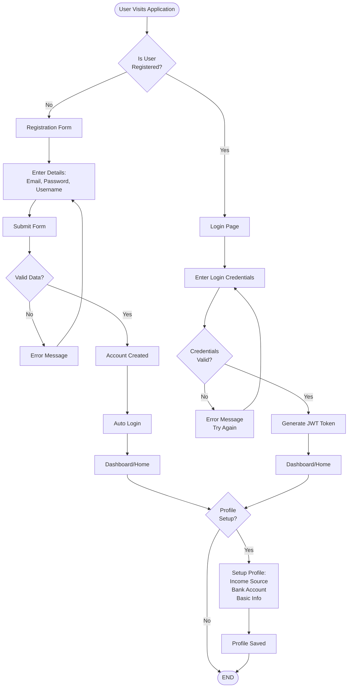

# User Authentication & Registration Flow

## Purpose
This flowchart shows the complete user journey for registration, login, and profile setup.

## User Story
"As a new user, I want to create an account, log in, and set up my profile so I can start managing my finances."

---

## Text-Based Flowchart (ASCII Art)

```
                    START
                      |
                      v
        +---------------------------+
        |  User Visits Application  |
        +---------------------------+
                      |
                      v
        +---------------------------+
        |   Is User Registered?     |
        +---------------------------+
              |              |
          NO  |              |  YES
              |              |
              v              v
    +----------------+  +------------------+
    |  Registration  |  |    Login Page    |
    |     Form       |  +------------------+
    +----------------+              |
              |                     |
              v                     |
    +----------------+              |
    | Enter Details: |              |
    | - Email        |              |
    | - Password     |              |
    | - Username     |              |
    +----------------+              |
              |                     |
              v                     |
    +----------------+              |
    |  Submit Form   |              |
    +----------------+              |
              |                     |
              v                     |
    +----------------+              |
    | Valid Data?    |              |
    +----------------+              |
        |          |                |
     NO |          | YES            |
        |          |                |
        v          v                |
   +--------+  +----------------+   |
   |  Error |  | Account Created|   |
   | Message|  +----------------+   |
   +--------+          |            |
              |        |            |
              |        v            |
              |  +------------------+
              |  |   Auto Login    |
              |  +------------------+
              |          |
              |          v
              |  +------------------+
              |  | Dashboard/Home  |
              |  +------------------+
              |          |
              +----------+
                      |
                      v
        +---------------------------+
        |  Enter Login Credentials  |
        +---------------------------+
                      |
                      v
        +---------------------------+
        |   Credentials Valid?      |
        +---------------------------+
              |              |
          NO  |              |  YES
              |              |
              v              v
    +----------------+  +------------------+
    |  Error Message |  |  Generate JWT    |
    |  Try Again     |  |  Token           |
    +----------------+  +------------------+
                              |
                              v
                    +------------------+
                    |   Dashboard/Home |
                    +------------------+
                              |
                              v
                    +------------------+
                    |  Profile Setup?  |
                    +------------------+
                              |
                    YES       |        NO
                              |
                              v
                    +------------------+
                    |  Setup Profile:  |
                    |  - Income Source |
                    |  - Bank Account  |
                    |  - Basic Info    |
                    +------------------+
                              |
                              v
                    +------------------+
                    |  Profile Saved   |
                    +------------------+
                              |
                              v
                          END
```

---

## Mermaid Diagram Format



---

## Step-by-Step Instructions

### Registration Flow
1. **User visits application** → Landing page or login screen
2. **User clicks "Register"** → Registration form appears
3. **User enters details**:
   - Email address
   - Password (must meet requirements)
   - Username
4. **User submits form** → System validates data
5. **If valid** → Account created, user auto-logged in
6. **If invalid** → Error message shown, user corrects and retries

### Login Flow
1. **User visits application** → Login page
2. **User enters credentials**:
   - Email or username
   - Password
3. **User clicks "Login"** → System validates credentials
4. **If valid** → JWT token generated, user redirected to dashboard
5. **If invalid** → Error message shown, user can try again

### Profile Setup Flow
1. **User lands on dashboard** → System checks if profile is complete
2. **If incomplete** → Profile setup prompt appears
3. **User adds information**:
   - Income sources
   - Bank accounts
   - Basic personal information
4. **User saves profile** → Profile data stored, user can now use full features

---

## Decision Points

| Decision Point | Condition | Path 1 | Path 2 |
|----------------|-----------|--------|--------|
| Is user registered? | Check existing account | Go to Registration | Go to Login |
| Valid registration data? | Email format, password strength | Show error, retry | Create account |
| Valid login credentials? | Email/username + password match | Show error, retry | Generate token, login |
| Profile setup needed? | Check if profile complete | Setup profile | Continue to dashboard |

---

## Outcomes

### Successful Outcomes
- ✅ **Account Created**: User can now login and access features
- ✅ **Login Successful**: User receives JWT token, access granted
- ✅ **Profile Complete**: User can access all application features

### Error Outcomes
- ❌ **Registration Failed**: Invalid data, email already exists, or password too weak
- ❌ **Login Failed**: Invalid credentials (wrong email/password combination)
- ⚠️ **Incomplete Profile**: Limited access until profile setup is completed

---

**Last Updated**: November 2025

