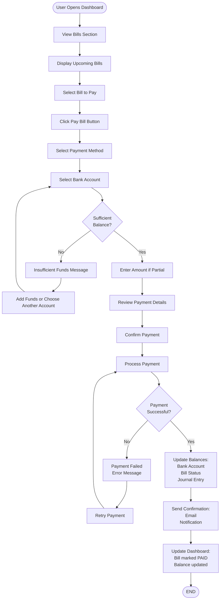

# Bill Payment Flow

## Purpose
This flowchart illustrates the complete process of paying a bill, from viewing due bills to payment confirmation.

## User Story
"As a user, I want to view my upcoming bills, select one to pay, and complete the payment so my bills are paid on time."

---

## Text-Based Flowchart (ASCII Art)

```
                         START
                           |
                           v
            +---------------------------+
            |   User Opens Dashboard    |
            +---------------------------+
                           |
                           v
            +---------------------------+
            |  View Bills Section       |
            +---------------------------+
                           |
                           v
            +---------------------------+
            |  Display Upcoming Bills   |
            +---------------------------+
                           |
                           v
            +---------------------------+
            |   Select Bill to Pay      |
            +---------------------------+
                           |
                           v
            +---------------------------+
            |  Click "Pay Bill" Button  |
            +---------------------------+
                           |
                           v
            +---------------------------+
            |  Select Payment Method    |
            +---------------------------+
                           |
                           v
            +---------------------------+
            |  Select Bank Account      |
            +---------------------------+
                           |
                           v
            +---------------------------+
            |  Sufficient Balance?      |
            +---------------------------+
                    |            |
                NO  |            |  YES
                    |            |
                    v            v
        +----------------+  +------------------+
        |  Insufficient  |  |  Enter Amount    |
        |  Funds Message |  |  (if partial)    |
        +----------------+  +------------------+
                    |                 |
                    v                 |
        +----------------+            |
        |  Add Funds or  |            |
        |  Choose Another|            |
        |  Account       |            |
        +----------------+            |
                    |                 |
                    +-----------------+
                               |
                               v
                    +---------------------------+
                    |  Review Payment Details   |
                    +---------------------------+
                               |
                               v
                    +---------------------------+
                    |  Confirm Payment          |
                    +---------------------------+
                               |
                               v
                    +---------------------------+
                    |  Process Payment          |
                    +---------------------------+
                               |
                               v
                    +---------------------------+
                    |  Payment Successful?      |
                    +---------------------------+
                        |              |
                    NO  |              |  YES
                        |              |
                        v              v
            +----------------+  +------------------+
            |  Payment Failed|  |  Update Balances |
            |  Error Message |  |  - Bank Account  |
            +----------------+  |  - Bill Status   |
                        |       |  - Journal Entry |
                        v       +------------------+
            +----------------+           |
            |  Retry Payment |           |
            +----------------+           |
                        |                |
                        |                v
                        |    +------------------+
                        |    |  Send Confirmation|
                        |    |  - Email         |
                        |    |  - Notification  |
                        |    +------------------+
                        |                |
                        |                v
                        |    +------------------+
                        |    |  Update Dashboard |
                        |    |  - Bill marked PAID|
                        |    |  - Balance updated |
                        |    +------------------+
                        |                |
                        +----------------+
                                   |
                                   v
                               END
```

---

## Mermaid Diagram Format



---

## Step-by-Step Instructions

### 1. View Bills
1. User logs into dashboard
2. Navigates to "Bills" section
3. System displays all upcoming bills with:
   - Bill name/provider
   - Due date
   - Amount due
   - Status (PENDING, PAID, OVERDUE)

### 2. Select Bill to Pay
1. User reviews list of bills
2. User clicks on a bill or selects "Pay Now" button
3. Bill details page opens showing:
   - Full bill information
   - Payment options
   - Payment history

### 3. Choose Payment Method
1. User selects payment method:
   - **BANK_TRANSFER**: Transfer from bank account
   - **CARD**: Credit/debit card payment
   - **WALLET**: Digital wallet payment
   - **CASH**: Cash payment (record only)

### 4. Select Bank Account
1. User selects which bank account to use
2. System checks account balance
3. If insufficient funds:
   - Error message displayed
   - User can add funds or choose different account
4. If sufficient funds:
   - Proceed to payment amount entry

### 5. Enter Payment Amount
1. Full amount is pre-filled (default)
2. User can enter partial payment amount if needed
3. System validates:
   - Amount > 0
   - Amount <= bill amount
   - Amount <= account balance

### 6. Review & Confirm
1. Payment summary displayed:
   - Bill details
   - Payment amount
   - Payment method
   - Bank account used
   - Transaction date
2. User reviews all details
3. User clicks "Confirm Payment"

### 7. Process Payment
1. System processes payment:
   - Deducts amount from bank account
   - Updates bill status (PENDING → PAID)
   - Creates journal entry for accounting
   - Records payment transaction
2. System validates transaction:
   - Checks database constraints
   - Ensures balance consistency
   - Creates audit trail

### 8. Payment Result
1. **If successful**:
   - Success message displayed
   - Confirmation email sent
   - Notification created
   - Dashboard updated with new balances
   - Bill marked as PAID

2. **If failed**:
   - Error message displayed
   - Reason for failure shown
   - User can retry payment
   - No changes made to accounts

---

## Decision Points

| Decision Point | Condition | Path 1 | Path 2 |
|----------------|-----------|--------|--------|
| Sufficient balance? | Check account balance >= payment amount | Show insufficient funds error | Proceed with payment |
| Payment successful? | Validate transaction processing | Show error, allow retry | Complete payment, update records |
| Partial payment? | User enters less than full amount | Process partial payment | Process full payment |
| Multiple payment methods? | User has multiple options | Show selection menu | Use default method |

---

## Outcomes

### Successful Payment
- ✅ **Payment Processed**: Amount deducted from account
- ✅ **Bill Updated**: Status changed to PAID
- ✅ **Balance Updated**: Bank account balance reduced
- ✅ **Journal Entry Created**: Accounting records updated
- ✅ **Confirmation Sent**: Email and notification sent
- ✅ **Dashboard Refreshed**: Updated balances displayed

### Failed Payment
- ❌ **Insufficient Funds**: Not enough money in selected account
- ❌ **Payment Processing Error**: System error during transaction
- ❌ **Invalid Payment Method**: Selected method not available
- ⚠️ **Retry Available**: User can attempt payment again

---

## Related Features
- **Auto-recurring Bills**: Bills automatically generated monthly
- **Payment Reminders**: Notifications before due dates
- **Payment History**: View all past payments
- **Bill Analytics**: Track spending patterns and trends

---

**Last Updated**: November 2025


