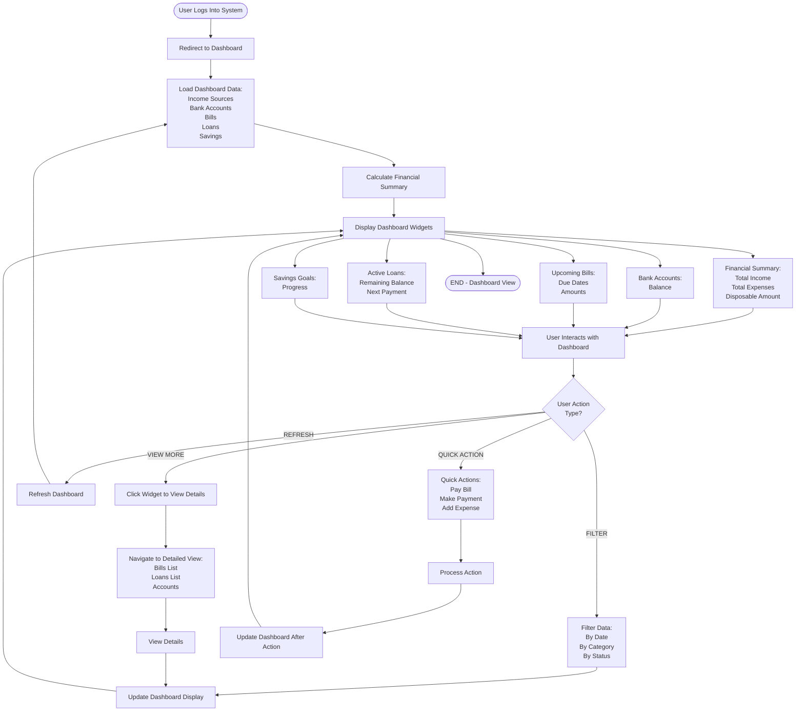

# Financial Dashboard View Flow

## Purpose
This flowchart illustrates how users navigate and interact with the financial dashboard to view their overall financial status.

## User Story
"As a user, I want to view my financial dashboard to see my income, expenses, disposable amount, bills, loans, and savings all in one place so I can understand my financial health."

---

## Text-Based Flowchart (ASCII Art)

```
                         START
                           |
                           v
            +---------------------------+
            |   User Logs Into System   |
            +---------------------------+
                           |
                           v
            +---------------------------+
            |   Redirect to Dashboard   |
            +---------------------------+
                           |
                           v
            +---------------------------+
            |   Load Dashboard Data     |
            |   - Income Sources        |
            |   - Bank Accounts         |
            |   - Bills                 |
            |   - Loans                 |
            |   - Savings               |
            +---------------------------+
                           |
                           v
            +---------------------------+
            |   Calculate Financial     |
            |   Summary                 |
            +---------------------------+
                           |
                           v
            +---------------------------+
            |   Display Dashboard:      |
            |   +------------------+    |
            |   | Financial Summary|    |
            |   | - Total Income   |    |
            |   | - Total Expenses |    |
            |   | - Disposable Amt |    |
            |   +------------------+    |
            |   +------------------+    |
            |   | Bank Accounts    |    |
            |   | - Balance        |    |
            |   +------------------+    |
            |   +------------------+    |
            |   | Upcoming Bills   |    |
            |   | - Due Dates      |    |
            |   | - Amounts        |    |
            |   +------------------+    |
            |   +------------------+    |
            |   | Active Loans     |    |
            |   | - Remaining Bal  |    |
            |   | - Next Payment   |    |
            |   +------------------+    |
            |   +------------------+    |
            |   | Savings Goals    |    |
            |   | - Progress       |    |
            |   +------------------+    |
            +---------------------------+
                           |
                           v
            +---------------------------+
            |   User Interacts with     |
            |   Dashboard Widgets       |
            +---------------------------+
                           |
                           v
            +---------------------------+
            |   User Action Type?       |
            +---------------------------+
              |      |      |      |
         VIEW |      |      |      |
         MORE |      |      |      |
              |      |      |      |
              v      |      |      |
    +----------------+      |      |
    | Click Widget   |      |      |
    | to View Details|      |      |
    +----------------+      |      |
              |             |      |
              v             |      |
    +----------------+      |      |
    | Navigate to    |      |      |
    | Detailed View  |      |      |
    | - Bills List   |      |      |
    | - Loans List   |      |      |
    | - Accounts     |      |      |
    +----------------+      |      |
              |             |      |
              v             |      |
    +----------------+      |      |
    | View Details   |      |      |
    +----------------+      |      |
              |             |      |
    FILTER    |             |      |
              v             |      |
    +----------------+      |      |
    | Filter Data    |      |      |
    | - By Date      |      |      |
    | - By Category  |      |      |
    | - By Status    |      |      |
    +----------------+      |      |
              |             |      |
    REFRESH   |             |      |
              v             |      |
    +----------------+      |      |
    | Refresh        |      |      |
    | Dashboard      |      |      |
    +----------------+      |      |
              |             |      |
    QUICK     |             |      |
    ACTION    |             |      |
              v             |      |
    +----------------+      |      |
    | Quick Actions: |      |      |
    | - Pay Bill     |      |      |
    | - Make Payment|      |      |
    | - Add Expense  |      |      |
    +----------------+      |      |
              |             |      |
              +-------------+
                           |
                           v
            +---------------------------+
            |   Update Dashboard        |
            |   (After Action)          |
            +---------------------------+
                           |
                           v
                           END
```

---

## Mermaid Diagram Format



---

## Step-by-Step Instructions

### 1. Dashboard Initial Load

1. **User Authentication**
   - User logs into system
   - JWT token validated
   - User redirected to dashboard

2. **Data Loading**
   - System loads all user financial data:
     - **Income Sources**: All income streams
     - **Bank Accounts**: All accounts with balances
     - **Bills**: Upcoming and pending bills
     - **Loans**: Active loans with payment schedules
     - **Savings**: Savings accounts and goals

3. **Financial Calculations**
   - System calculates:
     - **Total Income**: Sum of all income sources
     - **Total Expenses**: Sum of bills, loan payments, variable expenses
     - **Disposable Amount**: Income - Expenses
     - **Total Bank Balance**: Sum of all account balances
     - **Outstanding Debt**: Remaining loan balances

### 2. Dashboard Widget Display

The dashboard displays multiple widgets:

**Financial Summary Widget**
- Total monthly income
- Total monthly expenses
- Disposable amount (available money)
- Net savings rate

**Bank Accounts Widget**
- List of all bank accounts
- Current balance for each
- Total combined balance
- Quick access to account details

**Upcoming Bills Widget**
- Bills due in next 30 days
- Due date and amount
- Status indicators (PENDING, OVERDUE)
- Quick "Pay Now" buttons

**Active Loans Widget**
- List of active loans
- Remaining balance
- Next payment due date and amount
- Payment progress indicator

**Savings Goals Widget**
- Current savings accounts
- Progress toward goals
- Target amounts
- Completion percentage

### 3. User Interactions

**View More Details**
1. User clicks on any widget
2. Navigate to detailed section:
   - Clicking Bills → Bills list page
   - Clicking Loans → Loans list page
   - Clicking Accounts → Bank accounts page
   - Clicking Savings → Savings page

**Filter Data**
1. User selects filter options
2. Filter by:
   - **Date Range**: Last 7 days, 30 days, 90 days, custom
   - **Category**: Bills, Loans, Expenses, Income
   - **Status**: PENDING, PAID, OVERDUE, COMPLETED
3. Dashboard updates to show filtered data

**Refresh Dashboard**
1. User clicks refresh button
2. System reloads all data
3. Recalculates financial summary
4. Updates all widgets with latest information

**Quick Actions**
1. User clicks quick action buttons:
   - **Pay Bill**: Opens payment dialog for selected bill
   - **Make Payment**: Opens payment dialog for loan
   - **Add Expense**: Opens expense entry form
   - **Add Income**: Opens income entry form
2. Action completes
3. Dashboard automatically refreshes

---

## Decision Points

| Decision Point | Condition | Path 1 | Path 2 |
|----------------|-----------|--------|--------|
| User action type? | User clicks/interacts with dashboard | Navigate to detailed view | Perform quick action |
| Data available? | Check if user has financial data | Display widgets with data | Show empty state with setup prompts |
| Refresh needed? | Check if data is stale | Auto-refresh | Use cached data |
| Filter applied? | User selects filters | Update displayed data | Show all data |

---

## Dashboard Components

### Financial Summary Section
- **Total Income**: All income sources combined
- **Total Expenses**: Bills + Loans + Variable expenses
- **Disposable Amount**: Money available after expenses
- **Savings Rate**: Percentage of income saved
- **Trend Indicators**: Up/down arrows showing changes

### Upcoming Bills Section
- List of bills due soon
- Due date countdown (e.g., "Due in 5 days")
- Amount due
- Payment status
- Quick pay buttons

### Loan Overview Section
- Active loan count
- Total remaining balance
- Next payment due
- Payment schedule overview

### Bank Accounts Section
- Account names
- Current balances
- Account types
- Quick balance check

### Savings Goals Section
- Goal names
- Current progress
- Target amounts
- Completion dates

---

## Outcomes

### Successful Dashboard View
- ✅ **Data Loaded**: All financial information displayed
- ✅ **Calculations Complete**: Disposable amount and summaries calculated
- ✅ **Widgets Displayed**: All sections visible and interactive
- ✅ **Real-time Updates**: Dashboard reflects latest financial status

### Empty States
- ⚠️ **No Data**: User sees setup prompts if no data exists
- ⚠️ **Incomplete Profile**: Prompts to complete profile setup
- ⚠️ **No Bills/Loans**: Shows empty state with "Add" buttons

---

**Last Updated**: November 2025

