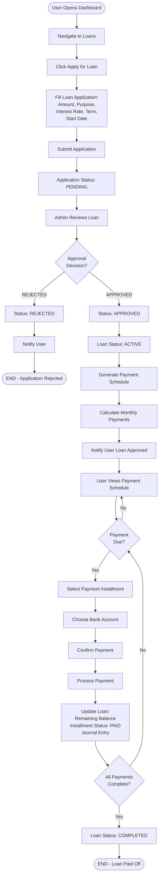

# Loan Application & Management Flow

## Purpose
This flowchart shows the complete process of applying for a loan, approval, payment schedule setup, and making payments.

## User Story
"As a user, I want to apply for a loan, track its approval status, manage payment schedules, and make regular payments to pay off my loan."

---

## Text-Based Flowchart (ASCII Art)

```
                         START
                           |
                           v
            +---------------------------+
            |   User Opens Dashboard    |
            +---------------------------+
                           |
                           v
            +---------------------------+
            |  Navigate to Loans        |
            +---------------------------+
                           |
                           v
            +---------------------------+
            |   Click "Apply for Loan"  |
            +---------------------------+
                           |
                           v
            +---------------------------+
            |   Fill Loan Application   |
            |   - Amount                |
            |   - Purpose               |
            |   - Interest Rate         |
            |   - Term (months)         |
            |   - Start Date            |
            +---------------------------+
                           |
                           v
            +---------------------------+
            |   Submit Application      |
            +---------------------------+
                           |
                           v
            +---------------------------+
            |   Application Status:     |
            |   PENDING                 |
            +---------------------------+
                           |
                           v
            +---------------------------+
            |   Admin Reviews Loan      |
            +---------------------------+
                           |
                           v
            +---------------------------+
            |   Approval Decision       |
            +---------------------------+
                      |          |
                REJECTED    APPROVED
                      |          |
                      v          v
            +----------------+  +------------------+
            |  Status:       |  |  Status:         |
            |  REJECTED      |  |  APPROVED        |
            |                |  +------------------+
            |  Notify User   |          |
            +----------------+          |
                      |                 v
                      |     +------------------+
                      |     |  Loan Status:    |
                      |     |  ACTIVE          |
                      |     +------------------+
                      |                 |
                      |                 v
                      |     +------------------+
                      |     |  Generate        |
                      |     |  Payment Schedule|
                      |     +------------------+
                      |                 |
                      |                 v
                      |     +------------------+
                      |     |  Calculate       |
                      |     |  Monthly Payments|
                      |     +------------------+
                      |                 |
                      |                 v
                      |     +------------------+
                      |     |  Notify User     |
                      |     |  Loan Approved   |
                      |     +------------------+
                      |                 |
                      |                 v
                      |     +------------------+
                      |     |  User Views      |
                      |     |  Payment Schedule|
                      |     +------------------+
                      |                 |
                      |                 v
                      |     +------------------+
                      |     |  Payment Due?    |
                      |     +------------------+
                      |                 |
                      |            YES  |
                      |                 v
                      |     +------------------+
                      |     |  Select Payment  |
                      |     |  Installment     |
                      |     +------------------+
                      |                 |
                      |                 v
                      |     +------------------+
                      |     |  Choose Bank     |
                      |     |  Account         |
                      |     +------------------+
                      |                 |
                      |                 v
                      |     +------------------+
                      |     |  Confirm Payment |
                      |     +------------------+
                      |                 |
                      |                 v
                      |     +------------------+
                      |     |  Process Payment |
                      |     +------------------+
                      |                 |
                      |                 v
                      |     +------------------+
                      |     |  Update Loan:    |
                      |     |  - Remaining Bal |
                      |     |  - Installment   |
                      |     |    Status: PAID  |
                      |     |  - Journal Entry |
                      |     +------------------+
                      |                 |
                      |                 v
                      |     +------------------+
                      |     |  All Payments    |
                      |     |  Complete?       |
                      |     +------------------+
                      |                 |
                      |            NO   |
                      |                 |
                      |                 |
                      +-----------------+
                                   |
                                   v
            +---------------------------+
            |  Loan Status: COMPLETED   |
            +---------------------------+
                           |
                           v
                           END
```

---

## Mermaid Diagram Format



---

## Step-by-Step Instructions

### Part 1: Loan Application

1. **Navigate to Loans Section**
   - User opens dashboard
   - Clicks on "Loans" menu item
   - Views existing loans (if any)

2. **Start Application**
   - User clicks "Apply for Loan" button
   - Application form appears

3. **Fill Application Details**
   - **Loan Amount**: Total amount requested
   - **Purpose**: Reason for loan (e.g., "Home improvement")
   - **Interest Rate**: Annual interest rate percentage
   - **Term**: Number of months for repayment
   - **Start Date**: When loan payments begin
   - Additional details as required

4. **Submit Application**
   - User reviews all entered information
   - Clicks "Submit Application"
   - Application status set to **PENDING**

### Part 2: Loan Approval Process

1. **Admin Review**
   - System notifies admin of new application
   - Admin reviews application details
   - Admin makes approval decision

2. **Approval Decision**
   - **If APPROVED**:
     - Loan status changes to **APPROVED**
     - Then to **ACTIVE** when disbursed
     - Payment schedule generated
   - **If REJECTED**:
     - Loan status changes to **REJECTED**
     - User notified with reason (if provided)
     - Process ends

### Part 3: Payment Schedule Generation

1. **Automatic Schedule Creation**
   - System calculates monthly payment amount
   - Creates payment installments for entire loan term
   - Each installment includes:
     - Due date
     - Principal amount
     - Interest amount
     - Total payment amount
     - Status: **PENDING**

2. **User Notification**
   - User receives notification
   - Can view payment schedule in loan details

### Part 4: Making Payments

1. **View Payment Schedule**
   - User opens loan details
   - Views all payment installments
   - Sees upcoming due dates and amounts

2. **Select Payment to Make**
   - User clicks on a pending installment
   - Or clicks "Pay Now" for next due payment
   - Payment screen opens

3. **Choose Payment Method**
   - User selects bank account to use
   - System checks sufficient balance
   - If insufficient, user must add funds or use different account

4. **Confirm and Process Payment**
   - User reviews payment details:
     - Installment amount
     - Bank account
     - Payment date
   - User clicks "Confirm Payment"
   - System processes payment

5. **Payment Processing**
   - Deducts amount from bank account
   - Updates installment status to **PAID**
   - Reduces loan remaining balance
   - Creates journal entry for accounting
   - Updates dashboard balances

6. **Payment Completion Check**
   - System checks if all installments are paid
   - If yes: Loan status changes to **COMPLETED**
   - If no: Continue with remaining payments

---

## Decision Points

| Decision Point | Condition | Path 1 | Path 2 |
|----------------|-----------|--------|--------|
| Approval decision? | Admin reviews application | APPROVED - Create schedule | REJECTED - Notify user |
| Payment due? | Check if any installments are due | Select payment to make | Wait or view schedule |
| Sufficient balance? | Check bank account balance | Add funds or change account | Proceed with payment |
| All payments complete? | Check if all installments paid | Loan COMPLETED | Continue payments |

---

## Outcomes

### Successful Outcomes
- ✅ **Application Submitted**: Status PENDING, awaiting admin review
- ✅ **Loan Approved**: Status APPROVED → ACTIVE, payment schedule created
- ✅ **Payment Made**: Installment marked PAID, balance reduced
- ✅ **Loan Completed**: All payments made, loan fully paid off

### Alternative Outcomes
- ❌ **Application Rejected**: Loan not approved, user notified
- ⚠️ **Payment Missed**: Installment overdue, may incur penalties
- 🔄 **Loan Modification**: User can extend term, modify payment schedule (if feature enabled)

---

## Additional Features

### Payment Schedule Management
- **Extend Loan**: Add additional months to payment schedule
- **Add Custom Payments**: Insert specific payment installments
- **Regenerate Schedule**: Rebuild payment schedule with new terms
- **Delete Installments**: Remove unpaid installments (with restrictions)

### Loan Status Tracking
- **PENDING**: Application submitted, awaiting approval
- **APPROVED**: Loan approved but not yet active
- **ACTIVE**: Loan active, payments in progress
- **COMPLETED**: All payments made, loan paid off
- **DEFAULTED**: Loan defaulted (if applicable)
- **REJECTED**: Application rejected

---

**Last Updated**: November 2025

